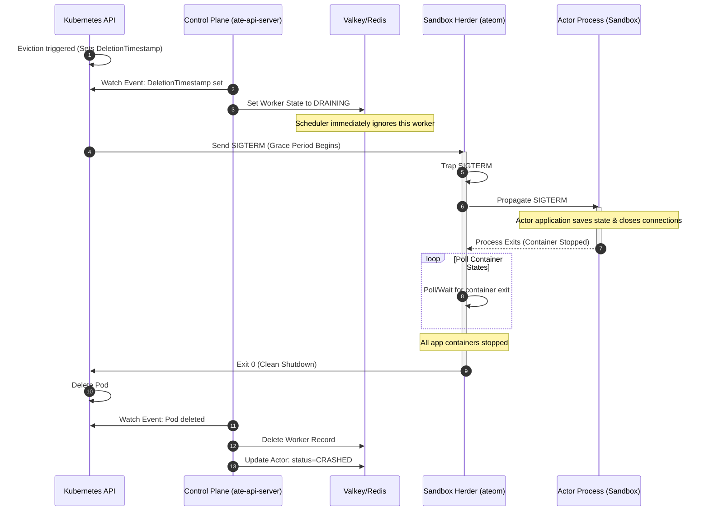

# Worker Lifecycle: Graceful Shutdown & Eviction (Propagated SIGTERM)

This document outlines the simplified design for worker pod graceful termination in Agent Substrate. Rather than force-suspending and snapshotting process memory from the control plane, the system propagates the termination signal (`SIGTERM`) to the actor process inside the sandbox, allowing the actor application to handle its own graceful shutdown, save its state, close connections, and exit.

---

## Scope

### In Scope
- **Eviction Detection**: Detecting the pod's `DeletionTimestamp` in the `ateapi` control plane to update scheduler state.
- **Valkey/Redis State Draining**: Transitioning the worker state to `DRAINING` in the control plane database to prevent new actor scheduling.
- **SIGTERM Propagation**: Trapping `SIGTERM` in `ateom` and forwarding it to the sandboxed containers via `runsc kill`.
- **Termination Polling**: Polling container status in `ateom` to ensure clean exit before the herder process terminates.
- **Database Cleanup**: Removing worker records and updating actor status in the control plane when the pod is deleted.

### Out of Scope
- **Control-Plane Suspend-to-RAM**: Force-checkpointing and memory-snapshotting running processes during pod eviction.
- **Non-Graceful Shutdown**: Node crashes, kernel panics, sudden VM terminations, and hardware failures.
- **Active Liveness Detection**: Worker heartbeats, lease renewals, and failure-detection loops.
- **Network Partitions & Fencing**: Leases, fencing, and split-brain resolution.

---

## Eviction Control Flow

The graceful eviction process is decoupled: the control plane manages scheduling state asynchronously via Kubernetes watch events, while `ateom` independently manages the local container signal propagation and exit lifecycle.

### 1. Control Plane State Management
The control plane (`ate-api-server`) watches Pod resources.
- **Draining**: When it detects `pod.DeletionTimestamp != nil`, it marks the worker as `DRAINING` in Valkey/Redis. This ensures the scheduler ([workflow_resume.go](file:///usr/local/google/home/sfunkenhauser/autoscaling-workspace/substrate/cmd/ateapi/internal/controlapi/workflow_resume.go)) immediately stops routing new actor requests to this worker.
- **Cleanup**: When it receives the `Deleted` watch event for the Pod, it:
  1. Deletes the worker record from Valkey/Redis.
  2. If the worker had an active actor assigned, it clears the worker assignment and updates the actor's status in Redis to `STATUS_SUSPENDED` (or `STATUS_EXITED`).

Because the control plane acts purely on watch events, there is no synchronous coordination or lock management required between `ate-api-server` and `ateom` during the eviction.

### 2. Local Signal Propagation (`ateom`)
The herder container (`ateom-gvisor` or `ateom-microvm`) receives `SIGTERM` from Kubernetes.

- **SIGTERM Trapping**: The daemon process traps `SIGTERM` and does not exit immediately.
- **State Metadata**: To know which guest sandbox or containers to signal, `AteomService` stores local, in-memory metadata of the active execution session when `RunWorkload` or `RestoreWorkload` is called:
  - `activeActorAtespace` and `activeActorID`.
  - `containerNames []string` (names of the containers running inside the sandbox).

The propagation mechanism depends on the active containerization runtime:

#### A. gVisor Runtime (`ateom-gvisor`)
- **Forwarding the Signal**: `ateom-gvisor` executes `runsc kill <container-name> SIGTERM` for each application container. This routes the signal directly to the actor processes inside the gVisor sandbox.
- **Shutdown Monitoring**: It executes `runsc wait <container-name>` (using a blocking command execution that waits for the container process to terminate) for each container.
- **Clean Exit**: Once `runsc wait` returns for all application containers, `ateom-gvisor` exits cleanly (`os.Exit(0)`), allowing the Kubernetes pod deletion to complete immediately.

#### B. Micro-VM Runtime (`ateom-microvm`)
- **Forwarding the Signal**: `ateom-microvm` utilizes the open `AgentClient` (connected via vsock to the `kata-agent` running inside the guest VM) and makes a `SignalProcess` RPC call to send `SIGTERM` to the container process.
- **Shutdown Monitoring**: It calls the blocking `WaitProcess` RPC on `kata-agent` (which mimics `waitpid(2)` for the guest processes) or monitors the `io.EOF` of the container's stdout/stderr streams.
- **Clean Exit**: Once the guest container exits or the agent connection closes, `ateom-microvm` issues a shutdown command to the Cloud Hypervisor API socket to stop the VM, and then exits cleanly (`os.Exit(0)`).

### 3. Graceful Termination Timeout (Kubernetes Grace Period)
To allow actors sufficient time to save their internal state (which may involve external database calls or syncing logs), the default `terminationGracePeriodSeconds` of Substrate worker pods will be increased to **5 minutes (300s)** (up from the Kubernetes default of 30s).

Additionally, a new field `terminationGracePeriodSeconds` will be introduced in the `WorkerPool` spec (`WorkerPoolSpec`) to allow administrators to customize the termination grace period per worker pool based on the workloads they host.

During eviction:
- If the actor process successfully performs its clean-up and exits within the configured grace period, `ateom` exits cleanly and the pod is deleted immediately.
- If the actor process hangs or takes longer than the configured grace period, the kubelet will send a `SIGKILL` to `ateom` and the sandbox, forcefully terminating all processes. The control plane will still cleanly handle this when it receives the `Deleted` watch event.

---

## Failure Modes & Edge Cases

### 1. Actor Ignores SIGTERM or Hangs
- **Problem**: The actor application explicitly ignores `SIGTERM` or hangs/deadlocks during its clean-up routine. (Note: if the application does not install a handler for `SIGTERM`, it will terminate immediately with a non-zero exit code, which `ateom` handles as a clean container stop).
- **Resolution**: `ateom` will continue polling container states. When the configured termination grace period (default 5m) is reached, Kubernetes sends a `SIGKILL` to the pod, killing `ateom` and forcing the sandbox down. The control plane eventually detects the pod deletion and cleans up the worker/actor states in Valkey/Redis.

### 2. `ateom` Crashes During Eviction
- **Problem**: The `ateom` container process crashes or is killed (e.g. by OOM killer) before the actor process exits.
- **Resolution**: The Kubernetes Pod will transition to `Failed` status. Kubelet cleans it up. The control plane receives the pod deletion event and cleans up the worker from Valkey/Redis and marks the actor as crashed.

### 3. Valkey/Redis Database Outage
- **Problem**: The control plane (`ate-api-server`) cannot write to Valkey/Redis during eviction.
- **Resolution**: The worker pod cannot be marked `DRAINING` in the database, potentially leading the scheduler to attempt scheduling new work to it. However, if a scheduling RPC (`RunWorkload` or `RestoreWorkload`) reaches the worker pod while `ateom` is in its shutdown sequence, `ateom` will immediately reject the request with a transient error (e.g., `codes.Unavailable`), forcing the control plane to reschedule the actor. Once the database recovers, the control plane syncer reconciles the state and cleans up the stale worker records.

### 4. Control Plane Misses Pod Events
- **Problem**: The control plane (`ate-api-server`) misses Kubernetes Pod watch events (e.g., due to network partitions, control plane downtime, watcher crashes, or API server rate limiting), thereby missing the `DeletionTimestamp` or `Deleted` events.
- **Resolution**: The worker pod's `ateom` process still receives the `SIGTERM` directly from the local kubelet and executes the local eviction flow. If the control plane fails to mark the worker `DRAINING` in the database, any new scheduling attempts to the pod will be rejected by `ateom` as it shuts down. Once the control plane recovers or reconnects, the worker pool syncer reconciles the current pod state from the Kubernetes API, catching up on missed state changes and cleaning up stale worker records in Valkey/Redis.

---

## Race Conditions

### 1. Control Plane: Concurrent Scheduling vs. Draining
- **Scenario**: The control plane attempts to schedule/resume an actor on a worker pod at the same time Kubernetes triggers the pod's eviction.
- **Handling**:
  - If the pod watcher marks the worker as `DRAINING` in Valkey/Redis *before* the scheduler transaction commits, the scheduler will fail to select this worker and select another one.
  - If the scheduler transaction commits first, the worker is assigned the actor. However, as the control plane's `ResumeActor` workflow starts and calls the `RestoreWorkload` RPC on the worker pod, `ateom` (which has already received `SIGTERM` and entered shutdown state) will immediately reject the gRPC call with `codes.Unavailable`. The control plane catches this error, cancels the resume on this worker, and reschedules the actor on a different pod.

### 2. Local Pod: SIGTERM Received During Active RPC
- **Scenario**: `ateom` receives `SIGTERM` from Kubelet while it is actively executing a gRPC request like `CheckpointWorkload` (during a manual suspend) or `RestoreWorkload` (during a resume).
- **Handling**:
  - `ateom` uses the `AteomService.lock` to serialize all lifecycle operations.
  - The asynchronous `SIGTERM` handler goroutine must acquire this service lock to set the shutdown state. However, to avoid blocking incoming RPCs for the entire grace period, **it releases the lock before signaling containers or polling for shutdown**.
  - **SIGTERM Handler Execution**:
    1. The signal handler acquires `AteomService.lock`.
    2. It sets `shuttingDown` to `true`.
    3. It snapshots the list of active container names from metadata.
    4. **It immediately releases the lock.**
    5. It proceeds to propagate `SIGTERM` and poll/wait for process exit *outside* the lock.
  - If `CheckpointWorkload` or `RestoreWorkload` is running when the signal handler starts, the handler blocks on step 1 until the active RPC releases the lock.
    - If a `RestoreWorkload` just completed, the snapshot in step 3 will capture the new container list and shut them down.
    - If a `CheckpointWorkload` just completed, the snapshot in step 3 will be empty, and the handler immediately exits.
  - If the signal handler runs step 1-4 *before* a new `RestoreWorkload` or `RunWorkload` RPC starts:
    - The new RPC acquires the lock.
    - It checks the `shuttingDown` flag under the lock, sees `true`, releases the lock, and fails-fast immediately with `codes.Unavailable` (without waiting).

