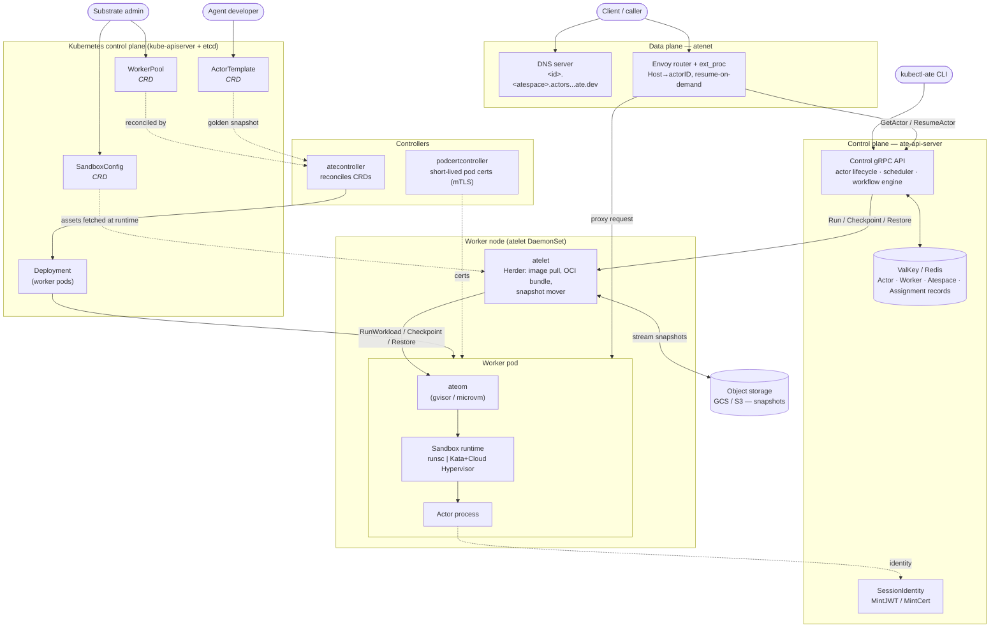

# Substrate — System Design Overview

Agent Substrate ("ate") runs huge numbers of bursty, agent-like workloads
("actors") at high density by multiplexing them onto a small pool of pre-warmed
sandbox pods, using snapshot/restore (checkpoint-restore) to reclaim resources
when idle. Kubernetes is deliberately kept **out of the hot path** so actor
activation can hit ~100ms p95 at very high scale.

## System diagram

## Request / resume flow (happy path)

1. **Client** resolves `<id>.<atespace>.actors.resources.substrate.ate.dev` via
   **atenet DNS** and sends HTTP to the **atenet router**.
2. Router extracts the actor ID from the `Host` header and asks
   **ate-api-server** for the actor's location (`GetActor`).
3. If suspended, control plane runs **`ResumeActor`**: claims a warm worker
   (Redis atomic assignment), tells that node's **atelet** to `Restore`.
4. **atelet** downloads the snapshot from **GCS/S3** and calls **ateom**
   `RestoreWorkload`, which does `runsc restore` (or micro-VM restore).
5. Worker pod IP flows back; router **proxies** the request to the pod.
6. When idle, **`SuspendActor`** checkpoints back to object storage and frees
   the worker. Actor state machine:
   `SUSPENDED → RESUMING → RUNNING → SUSPENDING → SUSPENDED`.

## Resource inventory

Two-tier resource model, split by how often the state changes.

### Kubernetes CRDs (group `ate.dev/v1alpha1`, stored in kube-apiserver/etcd)

| Resource | Scope | What it is |
|---|---|---|
| **WorkerPool** | Namespaced | Pool of pre-warmed sandbox worker pods; reconciled into a `Deployment`. Scalable via `scale` subresource. |
| **ActorTemplate** | Namespaced | Immutable definition of an actor version (image, resources, sandbox class, snapshot policy); triggers "golden snapshot" boot. |
| **SandboxConfig** | Cluster | Describes sandbox runtime binaries/assets (gVisor or micro-VM) fetched at runtime by workers. |

Each CRD has a generated manifest in `manifests/ate-install/generated/` and
Go types in `pkg/api/v1alpha1/`. WorkerPool and ActorTemplate have reconcilers
under `cmd/atecontroller/`.

### Substrate-native objects (proto-defined, stored in ValKey/Redis — NOT CRDs)

| Resource | Storage | What it is |
|---|---|---|
| **Actor** | Redis (`actor:<atespace>:<id>`) | A running/suspendable instance of an ActorTemplate; tracks status, location, snapshot refs. |
| **Worker** | Redis | A physical worker pod that can host an Actor; tracks pod IP, node, status, current assignment. |
| **Atespace** | Redis | Isolation/namespace boundary; an actor name is unique only within its Atespace. |
| **Assignment** | Redis (embedded in Worker) | Binding of a Worker to a specific Actor + ActorTemplate. |
| **Session identity** (being renamed to Actor) | credential | Stable JWT/cert identity for a workload that may migrate across workers. |

Defined in `pkg/proto/ateapipb/ateapi.proto`, served by the `Control` gRPC
service (`cmd/ateapi`). No CRD manifest or reconciler exists for any of these —
they are deliberately kept out of etcd for latency/scale.

## Components (binaries)

| Component | Kind | Role |
|---|---|---|
| **ate-api-server** (`cmd/ateapi`) | control plane | gRPC `Control` API; actor lifecycle, scheduling, snapshot coordination, atespaces, identity. |
| **atecontroller** (`cmd/atecontroller`) | K8s controller | Reconciles WorkerPool→Deployment, ActorTemplate (golden snapshots), SandboxConfig. |
| **atelet** (`cmd/atelet`) | node DaemonSet | "Herder": image pull, OCI bundle assembly, sandbox lifecycle, snapshot mover to/from GCS/S3. |
| **ateom** (`cmd/ateom-gvisor`, `cmd/ateom-microvm`) | in-pod agent | Runs inside worker pods; drives the sandbox runtime (runsc / Kata+Cloud Hypervisor). |
| **atenet** (`cmd/atenet`) | data plane | DNS + Envoy router with ext_proc; location-transparent routing and resume-on-demand. |
| **podcertcontroller** (`cmd/podcertcontroller`) | K8s controller | Issues short-lived pod certs for mTLS identity. |
| **kubectl-ate** (`cmd/kubectl-ate`) | CLI | kubectl plugin; manage atespaces/actors, list workers via gRPC. |

**Stack:** Go 1.26 · Kubernetes + controller-runtime · gRPC/protobuf · Envoy
(go-control-plane) · ValKey/Redis · GCS/S3 · gVisor / Kata + Cloud Hypervisor ·
OpenTelemetry · mTLS (short-lived pod certs) + JWT identity.
